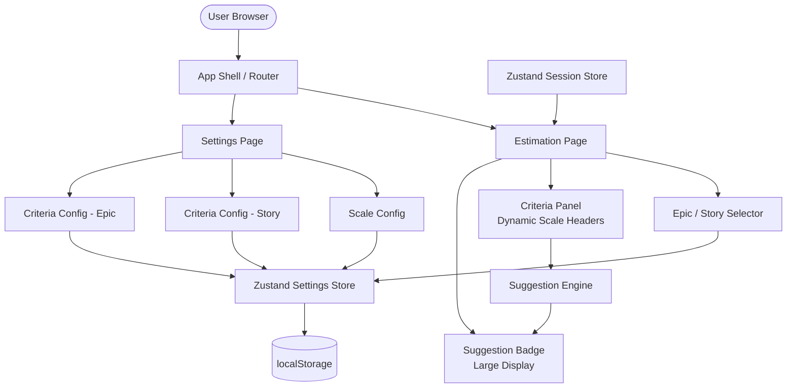
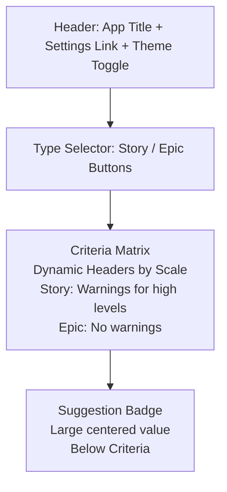
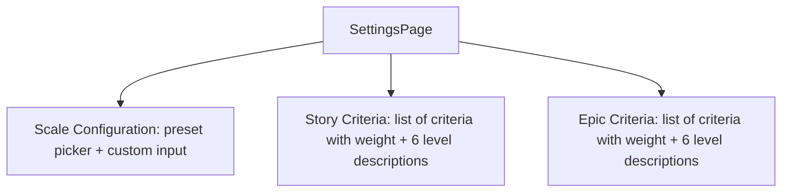

# Architecture – Planning Poker / Story Complexity Estimator

## 1. Tech Stack

| Layer | Technology |
|-------|-----------|
| Framework | React 18 + Vite |
| Language | TypeScript |
| Styling | Tailwind CSS |
| State Management | Zustand (with persist middleware) |
| Routing | React Router v6 + **HashRouter** (required for GitHub Pages) |
| Persistence | localStorage (via Zustand persist middleware) |
| Component Explorer | **Storybook 8** with `@storybook/addon-interactions` |
| Testing (future) | Vitest + React Testing Library |
| Hosting | **GitHub Pages** (static, via `gh-pages` branch + GitHub Actions) |

---

## 2. High-Level Architecture



---

## 3. Folder Structure

```
src/
├── components/
│   ├── criteria/
│   │   ├── CriteriaPanel.tsx         # Matrix with dynamic scale headers (Story/Epic warnings)
│   │   └── CriterionLevelSelector.tsx # Single criterion with 6 labelled level cards
│   ├── result/
│   │   └── ResultPanel.tsx            # Large centered badge showing only suggested value
│   ├── story/
│   │   └── TypeSelector.tsx           # Epic / Story toggle buttons
│   ├── settings/
│   │   ├── ScaleConfig.tsx            # Preset picker + custom scale input
│   │   └── CriteriaConfig.tsx         # Add/remove/rename criteria, weights, level descriptions
│   └── ui/
│       ├── LevelCard.tsx              # Single level option card
│       ├── Badge.tsx                  # Story point / scale value badge
│       └── ThemeToggle.tsx            # Dark/light mode toggle
├── engine/
│   └── suggestionEngine.ts            # Weighted SP calculation + ceiling scale mapping
├── store/
│   ├── useSettingsStore.ts            # Scale config + criteria catalogues (persisted)
│   └── useSessionStore.ts             # Current item type, level selections, result
├── types/
│   └── index.ts                       # Shared TypeScript interfaces
├── pages/
│   ├── EstimationPage.tsx             # Main: Type Selector (top), Criteria, Suggestion (stacked)
│   └── SettingsPage.tsx               # Scale + Criteria configuration
├── App.tsx
└── main.tsx
```

---

## 4. Core Data Types

```typescript
// types/index.ts

export type ItemType = 'story' | 'epic';

export type ScalePreset = 'fibonacci' | 'modified-fibonacci' | 'tshirt' | 'custom';

// Fixed level-to-SP mapping (immutable)
export const LEVEL_SP_MAP: Record<number, number> = {
  1: 1,
  2: 2,
  3: 3,
  4: 5,
  5: 8,
  6: 13,
};

export interface CriterionLevel {
  level: number;       // 1–6
  description: string; // editable by user
}

export interface Criterion {
  id: string;
  label: string;
  weight: number;           // 0–1, all weights in a catalogue must sum to 1
  levels: CriterionLevel[]; // exactly 6 entries
}

export interface ScaleConfig {
  preset: ScalePreset;
  values: (number | string)[]; // e.g. [1,2,3,5,8,13,...] or ['XS','S','M','L','XL','XXL']
}

export interface CriterionRating {
  criterionId: string;
  selectedLevel: number; // 1–6
}

export interface EstimationResult {
  weightedScore: number;             // raw weighted SP sum
  suggestedValue: number | string;   // ceiling-mapped to scale
  breakdown: {
    label: string;
    selectedLevel: number;
    spValue: number;
    contribution: number;            // sp_value * weight
  }[];
  finalValue?: number | string;      // user override
}
```

---

## 5. Suggestion Engine

**File:** [`suggestionEngine.ts`](../src/engine/suggestionEngine.ts)

### Algorithm

```
1. For each criterion i:
   sp_i     = LEVEL_SP_MAP[selectedLevel_i]       // fixed map
   contrib_i = sp_i × weight_i

2. weightedScore = Σ contrib_i

3. Ceiling-map to scale:
   - Find the first scale value v where numericValue(v) >= weightedScore
   - If none exists, use the maximum scale value
   - Return v as suggestedValue
```

### T-Shirt Size numeric mapping for ceiling logic

| T-Shirt | Numeric |
|---------|---------|
| XS | 1 |
| S | 2 |
| M | 3 |
| L | 5 |
| XL | 8 |
| XXL | 13 |

### Example (Fibonacci scale, Story)

| Criterion | Level | SP | Weight | Contribution |
|-----------|-------|----|--------|--------------|
| Technical Complexity | 4 | 5 | 0.30 | 1.50 |
| Uncertainty / Risk | 2 | 2 | 0.30 | 0.60 |
| Effort / Size | 3 | 3 | 0.30 | 0.90 |
| Dependencies | 1 | 1 | 0.10 | 0.10 |
| **Total** | | | | **3.10** |

Fibonacci scale: 1, 2, 3, 5, 8, 13 …  
First value ≥ 3.10 → **5 SP** (ceiling, not 3)

---

## 6. State Management

### `useSettingsStore` (persisted to localStorage)

| State | Type | Description |
|-------|------|-------------|
| `scale` | `ScaleConfig` | Active story point scale |
| `storyCriteria` | `Criterion[]` | Criteria catalogue for Stories |
| `epicCriteria` | `Criterion[]` | Criteria catalogue for Epics |
| Actions | `setScale`, `addCriterion`, `removeCriterion`, `updateCriterion`, `updateLevelDescription`, `resetDefaults` | |

### `useSessionStore` (in-memory, not persisted)

| State | Type | Description |
|-------|------|-------------|
| `itemType` | `ItemType` | 'story' or 'epic' |
| `ratings` | `CriterionRating[]` | Current level selections |
| `result` | `EstimationResult \| null` | Computed proposal |
| Actions | `setItemType`, `setRating`, `setResult`, `reset` | |

---

## 7. Routing

| Path | Page | Description |
|------|------|-------------|
| `/` | `EstimationPage` | Main estimation workflow |
| `/settings` | `SettingsPage` | Scale and criteria configuration |

---

## 8. UI Layout – Estimation Page



### Estimation Page Components Structure
- **Top**: Type Selector (Epic/Story toggle)
- **Below**: Complexity Criteria with dynamic scale headers
- **Bottom**: Suggestion Panel with large badge


### Settings Page Layout



---

## 9. Key UI Features

### Dynamic Scale Display
- **Criteria Panel Headers**: Display actual scale values (e.g., "XS", "S", "M" for T-Shirt; "1 SP", "2 SP" for Fibonacci)
- **Suggestion Badge**: Shows scale values with appropriate units ("SP" only for Fibonacci-based scales)
- **Unit Labels**: Omitted for T-Shirt and custom scales

### Story vs. Epic Warnings
- **Stories**: Column headers show "⚠ Should be split" (Lvl 4-5) and "⚠ Must be split" (Lvl 6) warnings
- **Epics**: No warnings shown (Epics are expected to be large)

### Suggestion Panel
- **Display**: Large centered badge showing only the suggested value
- **Height**: Fixed, matching the full height of the Criteria Panel for visual balance
- **No breakdown**: Simplified UI for faster decision-making

---

## 10. Default Criteria Catalogues

### Stories (default)

| Criterion | Weight | Level 1 | Level 6 |
|-----------|--------|---------|---------|
| Technical Complexity | 30% | Standard CRUD | Architectural decision, unknown territory |
| Uncertainty / Risk | 30% | Fully known, no risk | Completely unknown, high risk |
| Effort / Size | 30% | Trivial change | Months of work across teams |
| Dependencies | 10% | No dependencies | Many external / third-party dependencies |

### Epics (default)

| Criterion | Weight |
|-----------|--------|
| Business Value / Impact | 25% |
| Technical Complexity | 25% |
| Uncertainty / Risk | 20% |
| Number of Sub-Stories | 15% |
| External Dependencies | 15% |

---

## 10. Hosting – GitHub Pages

### Setup

| Step | Detail |
|------|--------|
| Build output | `dist/` folder (Vite default) |
| Base URL | Set `base: '/PlanningPokerTool/'` in [`vite.config.ts`](../vite.config.ts) to match the GitHub repo name |
| Router | Use `HashRouter` instead of `BrowserRouter` – GitHub Pages has no server-side redirect, so all routing must be hash-based (`/#/settings`) |
| Deployment | GitHub Actions workflow: on push to `main` → `npm run build` → deploy `dist/` to `gh-pages` branch |

### GitHub Actions Workflow (`.github/workflows/deploy.yml`)

```yaml
name: Deploy to GitHub Pages
on:
  push:
    branches: [main]
jobs:
  deploy:
    runs-on: ubuntu-latest
    steps:
      - uses: actions/checkout@v4
      - uses: actions/setup-node@v4
        with:
          node-version: 20
      - run: npm ci
      - run: npm run build
      - uses: peaceiris/actions-gh-pages@v4
        with:
          github_token: ${{ secrets.GITHUB_TOKEN }}
          publish_dir: ./dist
```

---

## 11. Storybook

### Configuration

| Item | Detail |
|------|--------|
| Version | Storybook 8 (`@storybook/react-vite` builder) |
| Tailwind | PostCSS config shared between Vite and Storybook via `.storybook/preview.ts` importing global CSS |
| Addons | `@storybook/addon-essentials`, `@storybook/addon-interactions`, `@storybook/addon-a11y` |
| Story location | Co-located: `src/components/**/*.stories.tsx` |

### Stories to implement

| Component | Story variants | Interaction tests |
|-----------|---------------|-------------------|
| [`LevelCard`](../src/components/ui/LevelCard.tsx) | Default, Selected, Disabled | — |
| [`Badge`](../src/components/ui/Badge.tsx) | All scale values | — |
| [`ThemeToggle`](../src/components/ui/ThemeToggle.tsx) | Light, Dark | — |
| [`TypeSelector`](../src/components/story/TypeSelector.tsx) | Story selected, Epic selected | — |
| [`StoryForm`](../src/components/story/StoryForm.tsx) | Empty, Filled | — |
| [`CriterionLevelSelector`](../src/components/criteria/CriterionLevelSelector.tsx) | No selection, Level 3 selected | — |
| [`CriteriaPanel`](../src/components/criteria/CriteriaPanel.tsx) | Story type, Epic type | ✅ Select levels, verify score updates |
| [`ResultPanel`](../src/components/result/ResultPanel.tsx) | No result, With suggestion, With override | ✅ Accept suggestion, manual override |
| [`ScaleConfig`](../src/components/settings/ScaleConfig.tsx) | Fibonacci, T-Shirt, Custom | — |
| [`CriteriaConfig`](../src/components/settings/CriteriaConfig.tsx) | Story catalogue, Epic catalogue | ✅ Add criterion, edit level description |

---

## 12. Future – Multiplayer Extension

When adding multiplayer, the following additions are needed:

| Concern | Approach |
|---------|----------|
| Transport | WebSockets via Socket.io or Supabase Realtime |
| Room management | Short join-code (6 chars) generated server-side |
| Backend | Node.js + Express or Supabase (BaaS) |
| State sync | Each participant submits level selections; host triggers reveal |
| Consensus | Weighted average of all participants scores → ceiling-mapped to scale |

The frontend store will be extended with a `useRoomStore` that syncs state over the WebSocket connection while `useSettingsStore` and `useSessionStore` remain unchanged.
